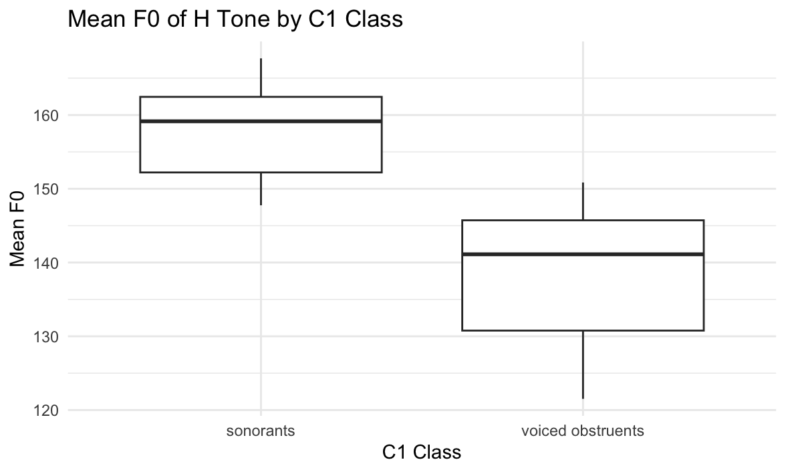
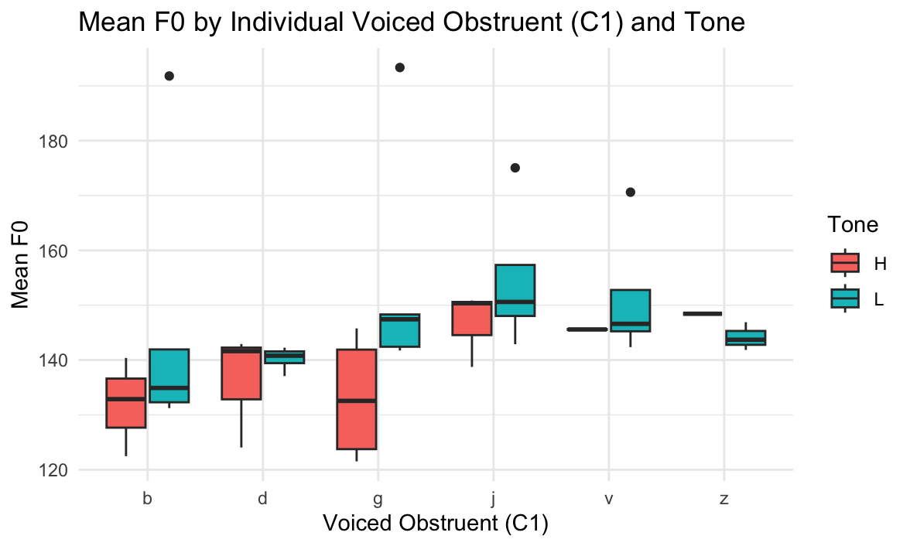

# Malawian CiTonga Tone Production Study

An exploratory phonetic study investigating how consonant context influences the pitch (F₀) of high (H) and low (L) tones in Malawian CiTonga verb stems. We present two experiments:

1. **Experiment A:** Compare mean F₀ of H tones following sonorant vs. voiced-obstruent onsets.  
2. **Experiment B:** Compare mean F₀ of H vs. L tones following individual voiced obstruents (b, d, j, g, v, z).

---

## Table of Contents

1. [Project Overview](#project-overview)  
2. [Data Description](#data-description)  
3. [Experiment A](#experiment-a)  
   1. [Hypotheses](#hypotheses)  
   2. [Visualization](#visualization-experiment-a)  
   3. [Statistical Test](#statistical-test-experiment-a)  
   4. [Conclusions](#conclusions-experiment-a)  
4. [Experiment B](#experiment-b)  
   1. [Visualization](#visualization-experiment-b)  
   2. [Statistical Test](#statistical-test-experiment-b)  
   3. [Conclusions](#conclusions-experiment-b)  
5. [Overall Discussion & Follow-up Questions](#overall-discussion--follow-up-questions)  
6. [Prerequisites](#prerequisites)  
7. [Installation & Usage](#installation--usage)  
8. [Script Breakdown](#script-breakdown)  
9. [Extending the Analysis](#extending-the-analysis)  
10. [Data Source & Acknowledgments](#data-source--acknowledgments)  
11. [License](#license)  

---

## Project Overview

We examine how the phonetic context of a verb stem onset (`C1.class` or individual `C1`) affects the realized pitch of H and L tones in CiTonga:

- **Experiment A:** Do H‐tone verbs exhibit different mean F₀ when the first consonant is a sonorant vs. a voiced obstruent?  
- **Experiment B:** For voiced‐obstruent onsets (b, d, j, g, v, z), is there a difference in mean F₀ between H‐tone and L‐tone verbs?

---

## Data Description

File: `citonga.csv`  
Columns of interest:
- **`Tone`**: target tone of the verb stem (`"H"` or `"L"`)  
- **`C1`**, **`C2`**: first and second consonants  
- **`C1.class`**: phonetic class of the first consonant (`"sonorants"` or `"voiced obstruents"`)  
- **`meanf0`**: mean fundamental frequency of the stem vowel (Hz)  
- Additional acoustic measures (`maxf0`, `minf0`, `intensity`, `duration`, etc.)

---

## Experiment A

### Hypotheses

- **H₀:** Mean F₀ of H tones does _not_ differ between sonorant vs. voiced-obstruent onsets.  
- **H₁:** Mean F₀ of H tones _does_ differ between these onset classes.

### Visualization (Boxplot)

```r
df_H <- subset(df, Tone == "H" & C1.class %in% c("sonorants","voiced obstruents"))
ggplot(df_H, aes(C1.class, meanf0)) +
  geom_boxplot() +
  labs(
    title = "Mean F₀ of H Tone by C1 Class",
    x     = "C1 Class",
    y     = "Mean F₀ (Hz)"
  ) +
  theme_minimal()
````

### Statistical Test

```r
sonorants_H <- subset(df, Tone=="H" & C1.class=="sonorants")$meanf0
voicedObs_H  <- subset(df, Tone=="H" & C1.class=="voiced obstruents")$meanf0
t.test(sonorants_H, voicedObs_H, var.equal=TRUE)
```

* **t** = 5.1426
* **df** = 23
* **p-value** ≈ 3.28×10⁻⁵

Since *p* < 0.05, we **reject** H₀: there is a significant difference in mean F₀.

### Conclusions

1. H-tone verbs preceded by sonorants have significantly higher mean F₀ than those preceded by voiced obstruents.
2. Onset consonant class influences pitch realization of H tones in CiTonga.

---

## Experiment B

### Visualization (Boxplot by Individual C1)

```r
voiced_obs <- subset(df, C1 %in% c("b","d","j","g","v","z"))
ggplot(voiced_obs, aes(C1, meanf0, fill=Tone)) +
  geom_boxplot() +
  labs(
    title = "Mean F₀ by Voiced Obstruent and Tone",
    x     = "Voiced Obstruent (C1)",
    y     = "Mean F₀ (Hz)"
  ) +
  theme_minimal()
```

**Observation:** Contrary to expectation, L-tone words often show higher mean F₀ than H-tone words after voiced obstruents.

<p align="center">
   
</p>

<p align="center">
   
</p>

### Statistical Test

```r
H_vo <- subset(df, Tone=="H" & C1 %in% voiced_set)$meanf0
L_vo <- subset(df, Tone=="L" & C1 %in% voiced_set)$meanf0
t.test(H_vo, L_vo, var.equal=TRUE)
```

* **t** = –5.4622
* **df** = 153
* **p-value** ≈ 1.86×10⁻⁷

*p* < 0.05 → reject H₀: mean F₀ differs significantly between H vs. L tones in this context.

### Conclusions

1. After voiced obstruents, L-tone stems have significantly higher mean F₀ than H-tone stems.
2. This reversal suggests a context‐dependent pitch enhancement of L tones or suppression of H tones, contrary to neutralization.

---

## Overall Discussion & Follow-up Questions

* **Phonetic interaction:** Onset consonant voicing class modulates pitch realization of both H and L tones.
* **Unexpected reversal:** L-tone exaggeration after voiced onsets raises questions about tonal implementation and downstep.
* **Follow‐up:** What phonological or aerodynamic mechanisms cause L tones to surface higher than H tones after voiced obstruents? How does this shape the tonal system and perceptual contrasts in CiTonga?

---

## Prerequisites

* **R** ≥ 4.0
* **RStudio** (optional)
* **Packages:** `ggplot2`, `ggmosaic` (for mosaic if extended)

---

## Installation & Usage

1. Clone the repository:

   ```bash
   git clone https://github.com/yourusername/citonga-tone-analysis.git
   cd citonga-tone-analysis
   ```
2. Place `citonga.csv` in the project root.
3. Run the analysis script:

   ```r
   source("citonga_tone_analysis.R")
   ```
4. View the generated figures in `figures/`.

---

## Script Breakdown

* **Load data** from `citonga.csv`.
* **Experiment A:** filter for H tones & compare by `C1.class`.
* **Experiment B:** filter for voiced‐obstruent onsets & compare by `Tone`.
* **Visualize** with `ggplot2` boxplots.
* **Test** with `t.test(..., var.equal=TRUE)`.
* **Print** results and interpret.

---

## Extending the Analysis

* Perform **two‐way ANOVA** on `meanf0 ~ Tone * C1.class`.
* Include other acoustic measures (intensity, duration).
* Use **mixed‐effects models** to account for speaker or lexical random effects.
* Visualize with **mosaic plots** for categorical interactions.

---

## Data Source & Acknowledgments

* Acoustic measurements collected in Malawian CiTonga fieldwork (unpublished).
* Thanks to field assistants and native speakers for data collection.

---

## License

This project is released under the **MIT License**. See `LICENSE` for details.

